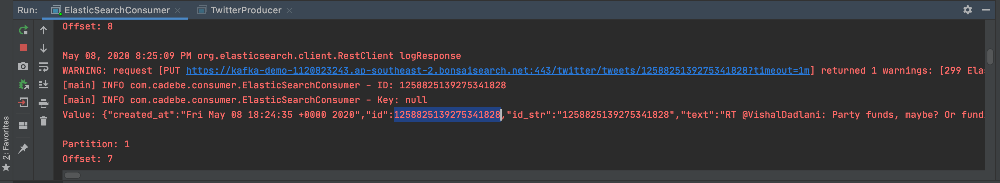
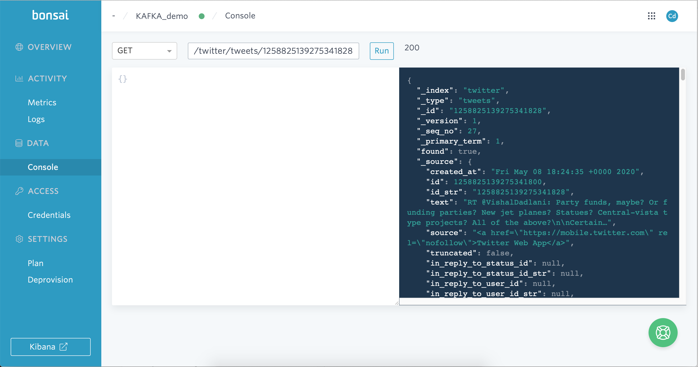

# Kafka Twitter-ElasticSearch Demo Project
[](https://github.com/Carla-de-Beer/kafka-twitter-elasticsearch/issues)

This project uses a Kafka-based Producer to draw real-time Twitter source data and sends this to an ElasticSearch Kafka-based consumer sink.

The producer is configured to be safe and high-throughput. The consumer is idempotent so that the `acks=all` configuration can be applied to the producer. Hosebird is used as a Java HTTP client for consuming the standard Twitter Streaming API.

## Getting started
* Set up a Twitter developer account and add the credentials to the `kafka-producer`'s `application.properties` resource file.
* Set up an ElasticSearch account (this example uses bonsai.io) and add those to the `elasticsearch-consumer`'s `application.properties` resource file.  
* Run the following ElasticSearch commands:
    * Create a Twitter index by executing `PUT /twitter`.
* Set up the Kafka cluster by starting the Zookeeper and the Kafka servers:
    ```zookeeper-server-start /usr/local/etc/kafka/zookeeper.properties```
    ```kafka-server-start /usr/local/etc/kafka/server.properties```
* Run the `TwitterProducer` file to extract Tweets:
    ```kafka-console-consumer --bootstrap-server localhost:9092 --topic tweets --from-beginning```

* Check the response id value from the terminal, and check it against the ElasticSearch database to view the Tweet:

<br/>
<p align="center">
  
</p>
<p align="center">
  
</p>
